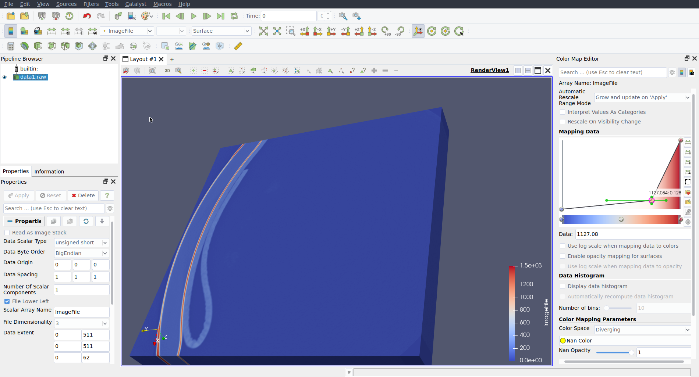
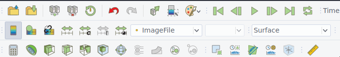
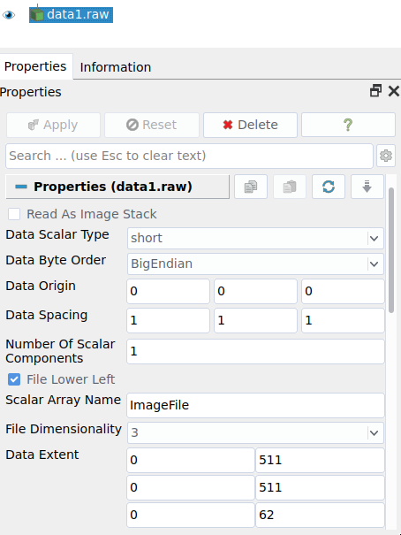
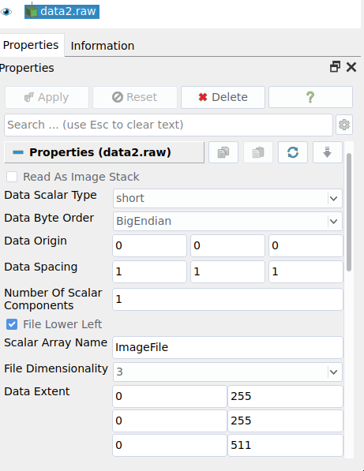
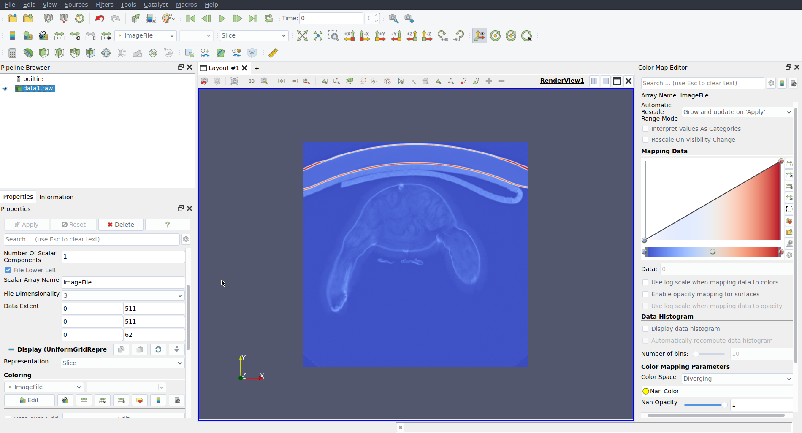
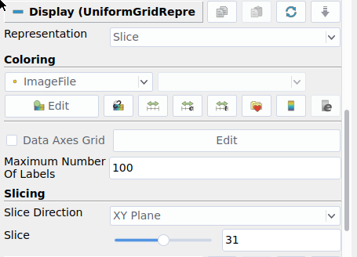

---
title: Assignment 2 --- Volume visualization
subtitle: Deadline 11 a.m. on 5 May, 2021 
author: Dr T. Torsney-Weir
bibliography: /home/tom/Papers/vis_module.bib
...

By submitting this coursework, electronically and/or hardcopy, you state that
you fully understand and are complying with the university's policy on
Academic Integrity and Academic Misconduct. The policy can be found at
<https://myuni.swansea.ac.uk/academic-life/academic-misconduct/>.

Credits for CSC337/CSCM37
: 25% of module

# Motivation

You are given a selection of three volume data sets. Two of the three are
unknown and mysterious. Your job is to explore, hypothesize, and discover what
phenomena the data sets depict through the use of volume rendering. Rather than
producing a volume renderer from scratch, you are to use an existing volume
renderer called ParaView (<http://www.paraview.org>) to help you with your
exploration. As an alternative, you may develop the volume renderer using
[three.js](https://threejs.org/). *You are not restricted to the above
software. You may use any volume rendering software but you need to clear it
with me first.* 

# Tasks

Paraview is an advanced, state-of-the-art volume rendering tool freely
available for educational and research purposes. It is based on open source
volume rendering libraries which enable interactive visualization of volumetric
data sets with high flexibility. They are implemented as a multi-platform
(Windows and Linux) C++ libraries using OpenGL and GLSL for GPU-based
rendering, licensed under the terms of the GNU General Public License. In order
to accomplish this task, you are to explore the software's features (look for
"Features") with a special focus on their various volume rendering techniques
and transfer functions. three.js is is a mature javascript library for
developing 3D rendered scenes. It can be used for volume rendering (e.g.
<https://threejs.org/examples/webgl2_materials_texture3d.html>).

The aim of this assignment is to learn to use state-of-the-art volume
visualization tools. Select a tool and, for each dataset, indentify the
characteristics of the data and ultimately unravel what they are or what you
think they are.

- Can you use volume rendering to gain an overview of the data?
- Can you discover any patterns or trends in the data?
- Does the data have any features, at a large scale or a small scale?
- What do you think the data sets are?
- What phenomena do the data sets try to capture?
- Can you support your answers with visualizations that provide evidence?

You do not necessarily need to answer these questions directly. My hope is that
in the proces of doing the assignment you will discover some of the answers to
these questions.  You will do this for 3 different tasks listed below.

Your task is to use [literate visualization](https://www.gicentre.net/litvis)
to produce **five different** visual designs which can convey some meaningful
and hopefully interesting insight about the data.  You are required to supply
five unique observations about the data (and not just repeat the same
observation over and over).  For each design, fill out a literate visualization
schema as discussed in
<https://github.com/gicentre/litvis/blob/main/documents/tutorials/introduction/intro2.md>.

Each visualization design you create should be in a separate markdown file.
Unlike the first coursework, you can just embed videos or images in the
markdown file.  Thus you will have 5 files at the end.  **You must include
images and code in the markdown files** to create your visualizations.  There
is a prepared set of files at
<https://github.com/SwanseaU-TTW/csc337_volvis_cw>. 

## Task 1: Getting started

Start off with rendering a known data set. We recommend you render a known data
set supplied by one of the renderers from the list first.  It can be downloaded
from: <https://www.paraview.org/download/>. You may need to set the version
field to v5.8 to get the data files.  Any sample data set may be used to get
started.

## Task 2: Mystery Data Sets

There are 2 mystery data sets listed with the assignment. Your job is to 
use one of the volume visualization software packages to produce 2 
visualizations for each of the 2 datasets (so 4 total).

Currently, there are two phenomena to discover, one is called data1 and the
other data2. They are not exciting names but part of your task is to discover
what these 2 objects are! These are both volume datasets that have appeared in
the scientific visualization literature many times already. 

# Description Template

Provide the following information for each visual design you create. In
parenthesis are the literate visualization labels to use to identify these in
the source files:

Aim (`aim`):
: Things we can learn from the visualization, e.g., from this visualization
  we can see this pattern...

Visual Design Type (`vistype`):
: The name/type of the visual design

Image:
: The visualization itself as an image

Visual Mappings (`vismapping`): 
: Each of the visual design mappings. Include the data mapping 
  information about color, shape, size, position (x,y axes), and any other 
  visual mappings. 

Data Preparation (`dataprep`): 
: Any modifications to the original data that had to be performed to 
  generate your beautiful image.

Improvements (`improvements`):
: What are the limitations of your visualization? What improvements could 
  you make to it?

A good observation requires interpretation of the resulting image that you generate.

# Guidance 

## Loading data into ParaView

Since the field of data visualization has not yet evolved to the point of using
universal data format standards, the two datasets have been converted into 
raw format so they can be read. 

You can load in data files using the menu. Just be sure to select "image
reader" as the processor in the dialog box. Raw images don't have any
specification of size so you will need to enter this in the "extents" section
of the interface. This is how you tell paraview how the bytes in the raw
datafile are laid out. The two datasets have different sizes so will require
different numbers in the extent fields.



Also make sure that you select "imageFile" as the drawing type and either
surface or points to get started.



### data1

Set the extents according to the following image:

{height=10cm}

In summary:

* x 0 -- 511
* y 0 -- 511
* z 0 -- 62

### data2

Set the extents according to the following image:

{height=10cm}

In summary:

* x 0 -- 255
* y 0 -- 255
* z 0 -- 511

## Viewing slices

You can get a nice overview of the data by looking at slices:



You can change this view by setting the "representation" to slice. Then there
will be a slicing section. You can change the direction and which slice you
look at using the controls in that slicing section:

{height=6cm}

## Help and Hints

- ParaView's web site has lots of helpful documentation on how to use it.
- YouTube features helpful introductory videos on how to use the ParaView 
  volume rendering software.
- You can post any number of questions on VisGuides.org or the tool authors
  for help if you run into problems.
- The teaching assistant can also help you. But don't wait until the day before the deadline.

# Todos

Your task is to produce 5 different visualizations that convey some meaningful
and hopefully interesting insight about three data sets and support your
hypothesis as to what they may be.  The three data sets are 1) one of the sample
data sets provided by the software you choose, 2) data1, and 3) data2.

# Submission

You are required to submit a document, which contains your name, student
number, and **five narrative examples** with complete template information as
in the example submission.  *Make sure each of your visual design types is
distinct.*  In other words, two Treemap layouts are two instances of one visual
design.

If you used three.js to produce your visualizations, please include the code
inside code blocks in the markdown files.

Create a directory with your student number. Then put the final pdf, all 
markdown, and all data files used. Make sure it's laid out as:

```
<student number>
|- coursework.md
|- data1_1.md
|- data1_2.md
|- data2_1.md
|- data2_2.md
|- <studentnumber>.pdf
|- ...
```

Then, zip this directory. Please create a **.zip file** and not a tar, gzip, or
any other format. Make sure extracting this zip file properly recreates this
directory. **Note that datafiles are not to be included this time!**.

You are required to upload the zip file to Canvas. **If you only submit the
code or the pdf then you will receive a mark of 0**

## Creating a pdf from VS Code preview

The easiest way I've found to create a pdf from the preview is:

1) Right click on the preview window
2) Select "Open in Browser" from the menu. Your web browser should open
3) Use the print to pdf functionality of your browser
4) Once you have all 5 of these, combine the pdfs together.

