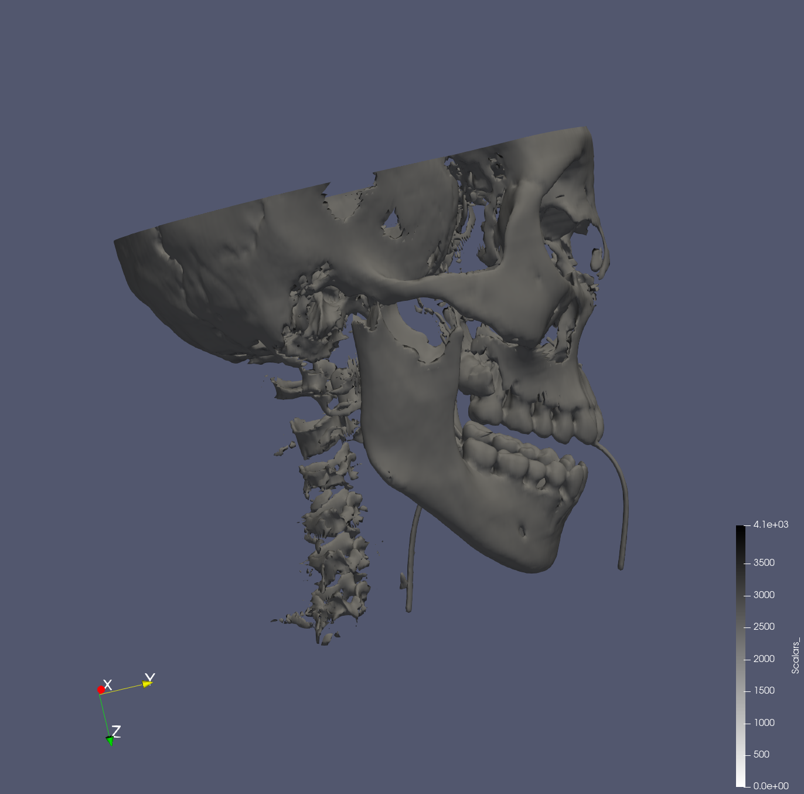
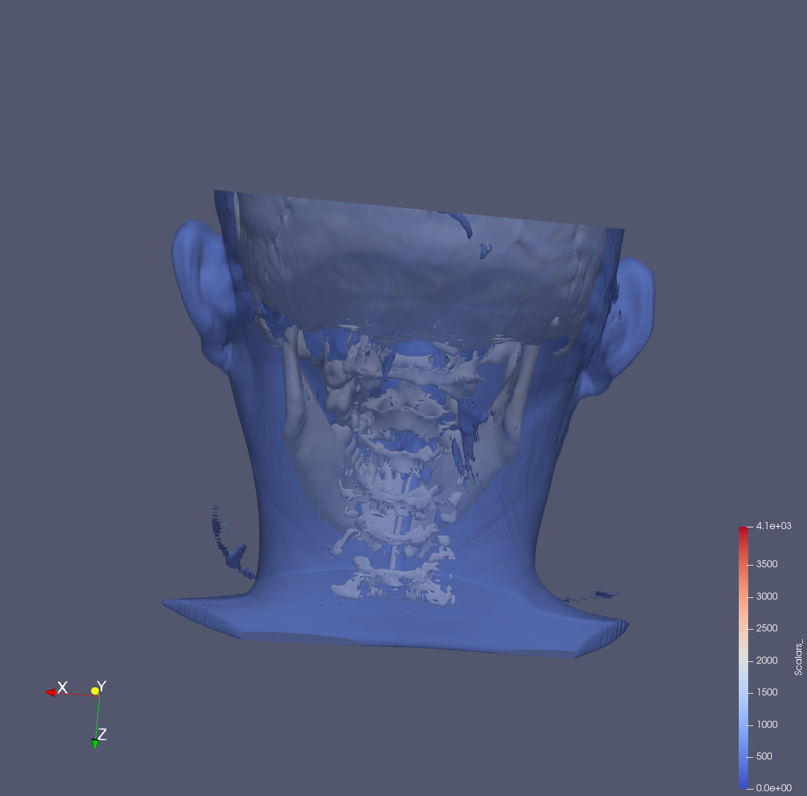

---
elm:
  dependencies:
    gicentre/elm-vegalite: latest

narrative-schemas:
  - coursework
---

Author: Ummi Aishatu Ibrahim (940165)

Before using these sets of documents, make sure you have everything installed
correctly. Installation instructions are here:
<https://github.com/gicentre/litvis/blob/main/documents/tutorials/introduction/installingLitvis.md>.

**In this file you can put the visualization based on the sample dataset**

{(aim|}
  After visualizing the object, a user will be able to understand that the object presented is a human head.
  For the human head, the user can see different aspects of the visualization, which includes: 
  1- The skull,
  2- The organs present in the head,
  3- The slice through the middle of the head to see what the skeleton and thr organs looks like in the middle.
  4- The combination of the skull, the organs and the human flesh using the opacity. 
{|aim)}

slice

front view skeleton

side view skeleton

back view skeleton

organs in the head 

final combination 

{(vismapping|}

**Representation**: Volume 
**Backface Representation**: Follow frontface
**Backface Opacity**:0.41 
**Contour**:(isosurface(500))
**Slice**:(Y-Normal(129.547,127.5,93))

{|vismapping)}

{(dataprep|}

1- Threshold 
2- Coutour 
3- Slice 
4- Clip

{|dataprep)}

{(limitations|}

Limitation1 - Some of the organs were not clear, meaning it was very hard to see. 

Improvement1 - Try and give the organs a high quality visualization representation.

Limitation2 - The threshold filter for the data was very slow and always showed black screem unless you move it. 

improvement2 - Use a lower version of Paraview instead of 5.8.1. 

{|limitations)}

