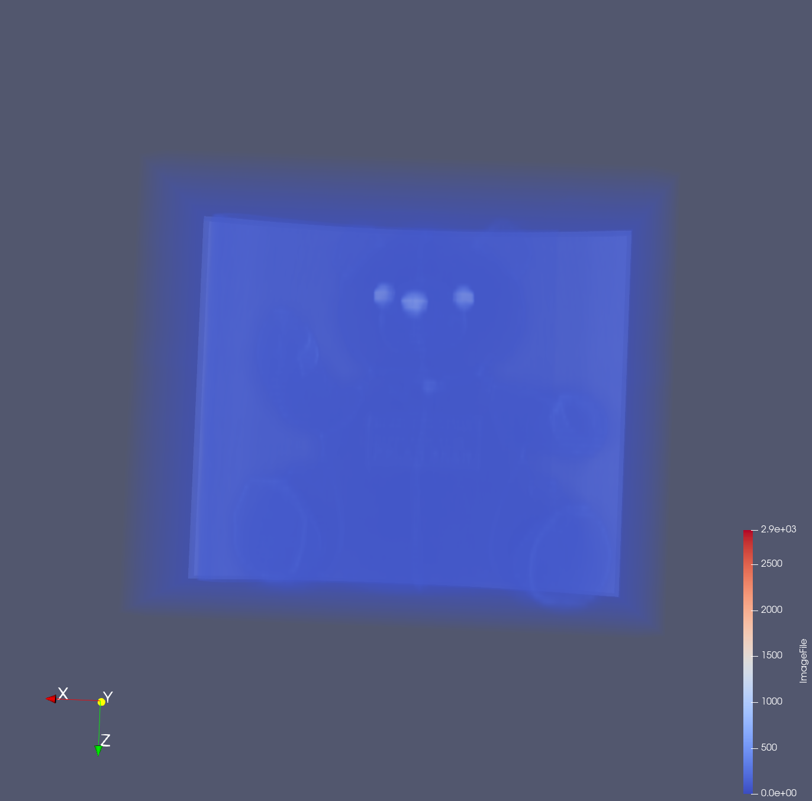
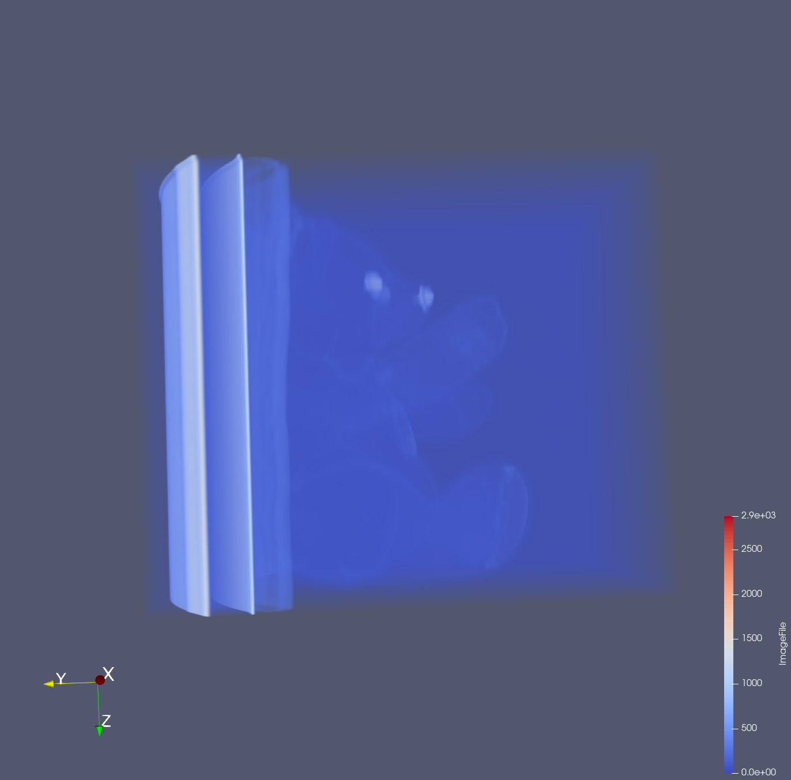
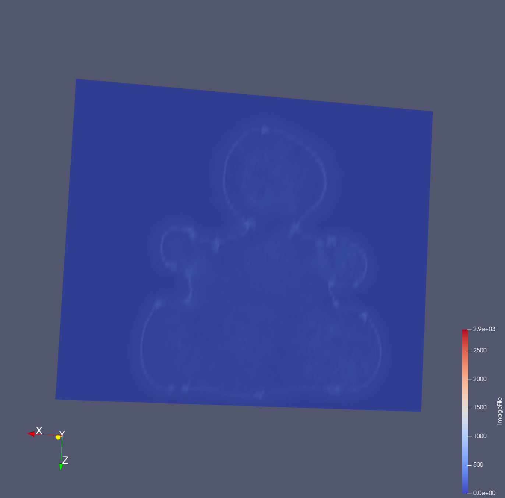
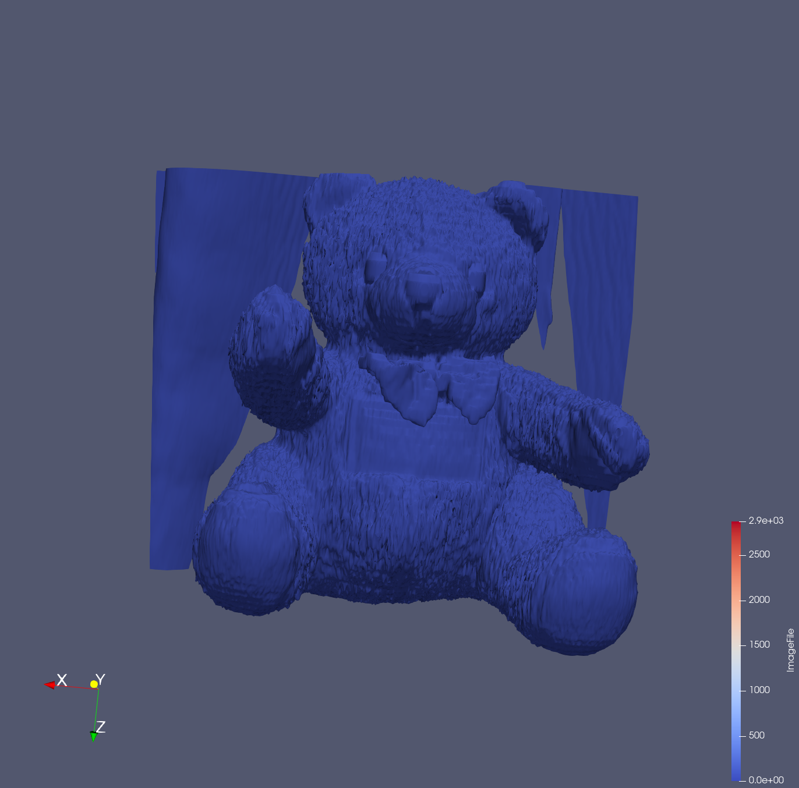
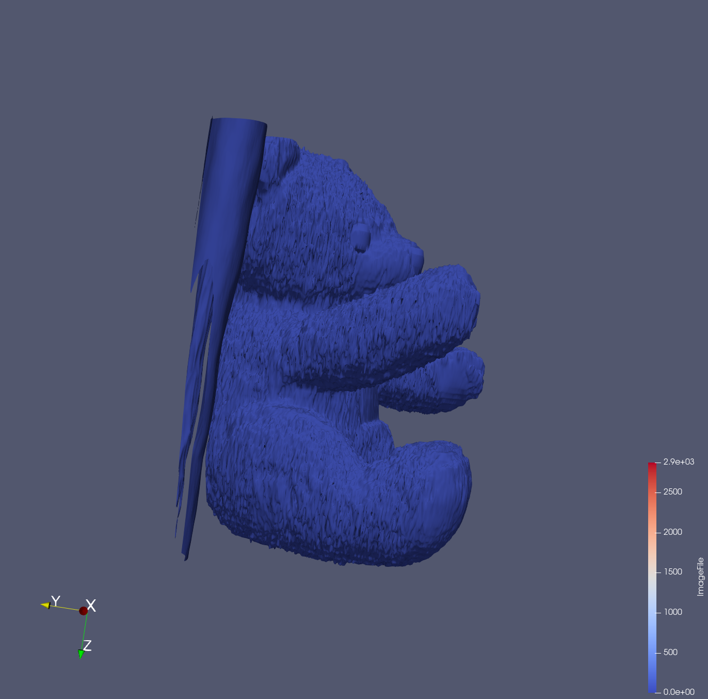

Put your 1st data1 design concept here

{(aim|}
After visualizing, a user can be able to see that the object that was presented is a teddy bear.
The user can view the which has a bow and a label around his tummy. 
{|aim)}

To show that the teddy bear in the object.

The slice to show the teddy bear 

The teddy bear 

{(vismapping|}
**Properties**: 1- (Data extent -> (0 - 511),(0 - 511),( 0 - 62 )) and (2- Data spacing -> (1 - 1 - 7))
**Contour**: Isosurface -> 50 
**Backface Representation**: follow frontface 
**Representation**: Surface
**Clip type**: Box (length (500 - 280 - 530))
**Slice type**: Plane (Y-Normal (Origin(255.5 - 291.047 - 217)))
{|vismapping)}

{(dataprep|}
1- ExtractSubset 
2- Contour 
3- Clip
4- Slice
{|dataprep)}

{(limitations|}

limitation- User cannot view bow and the content written on the label. 

improvement- High quality visualization (learn more about how to visualize and give it more quality.)

{|limitations)}
