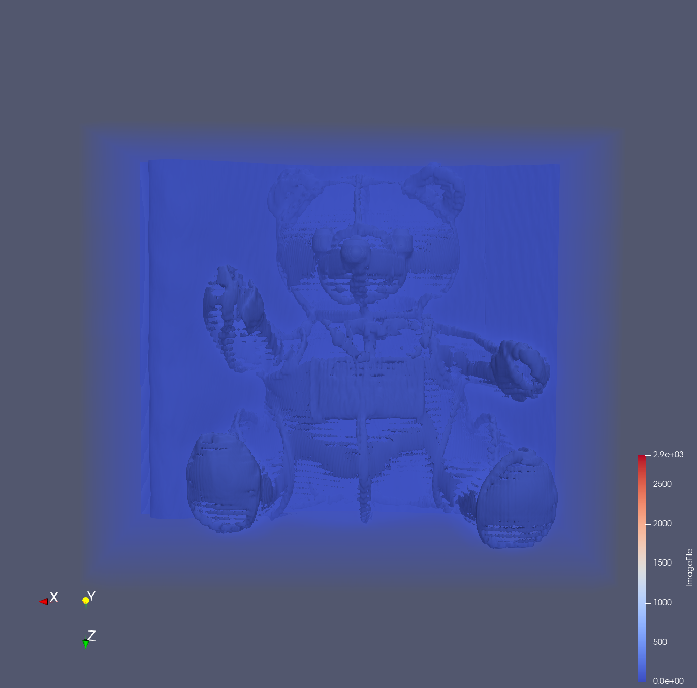
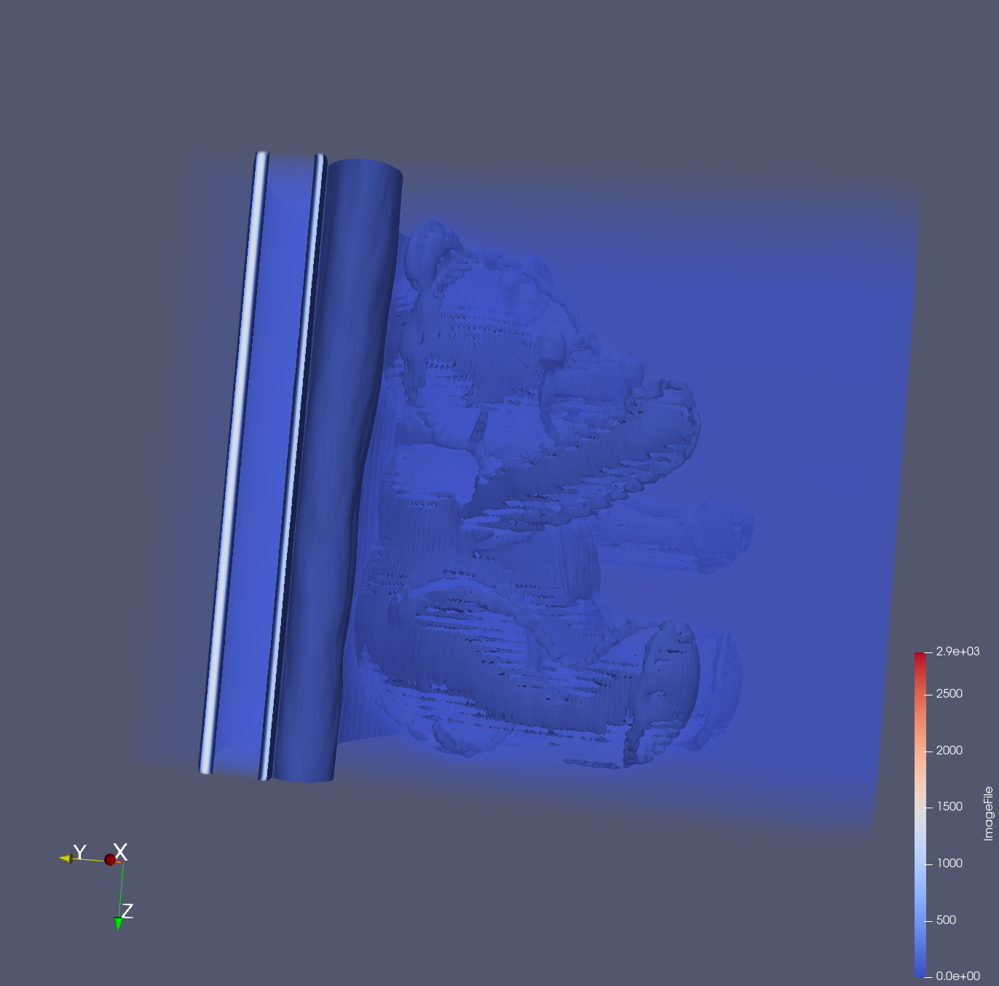
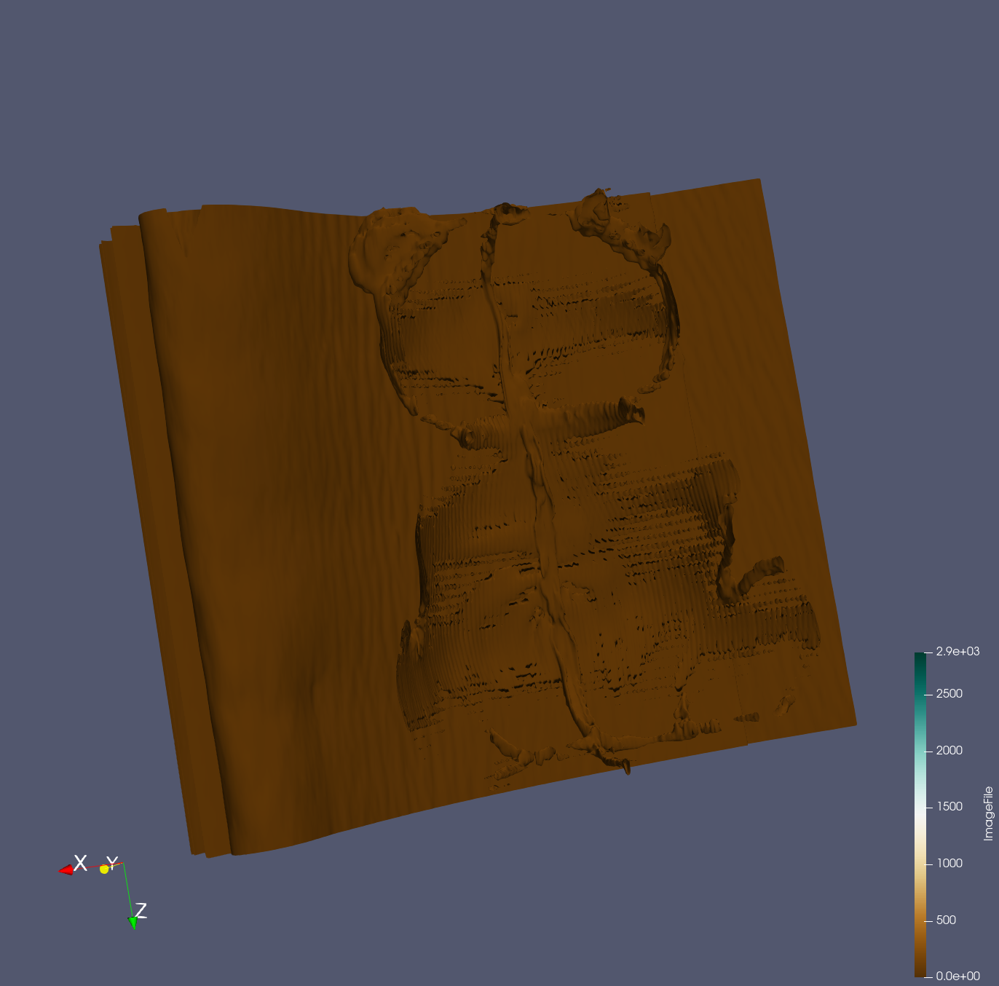
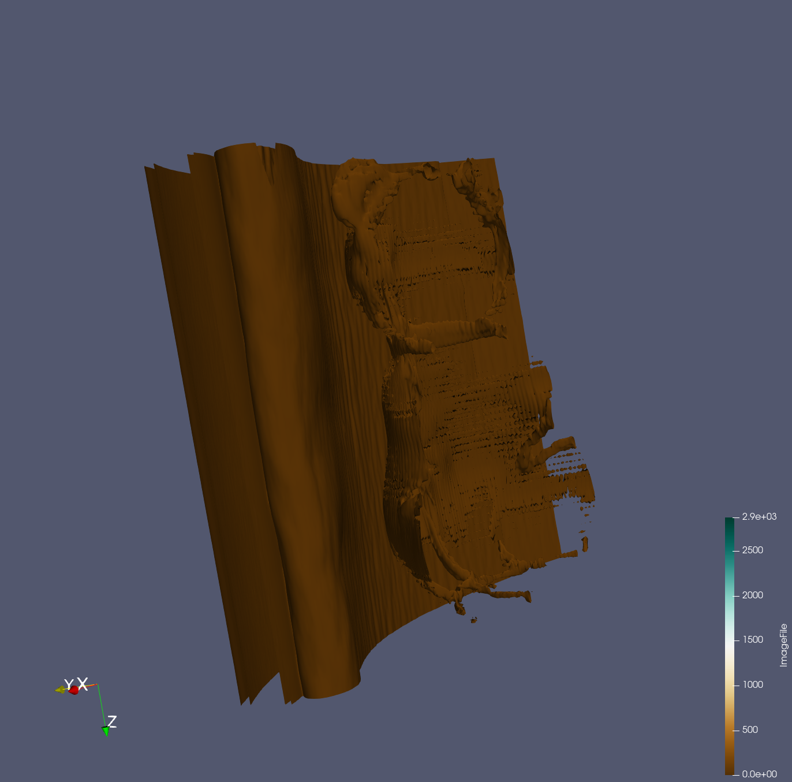
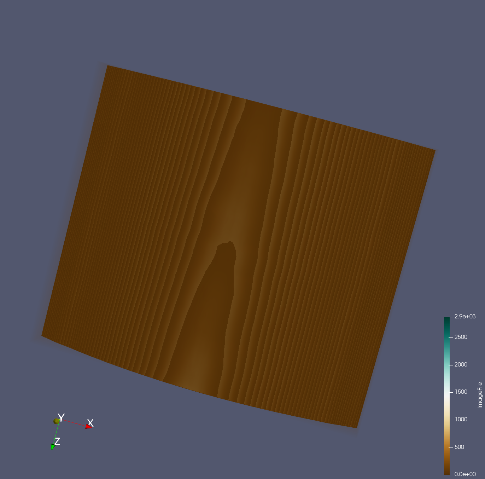
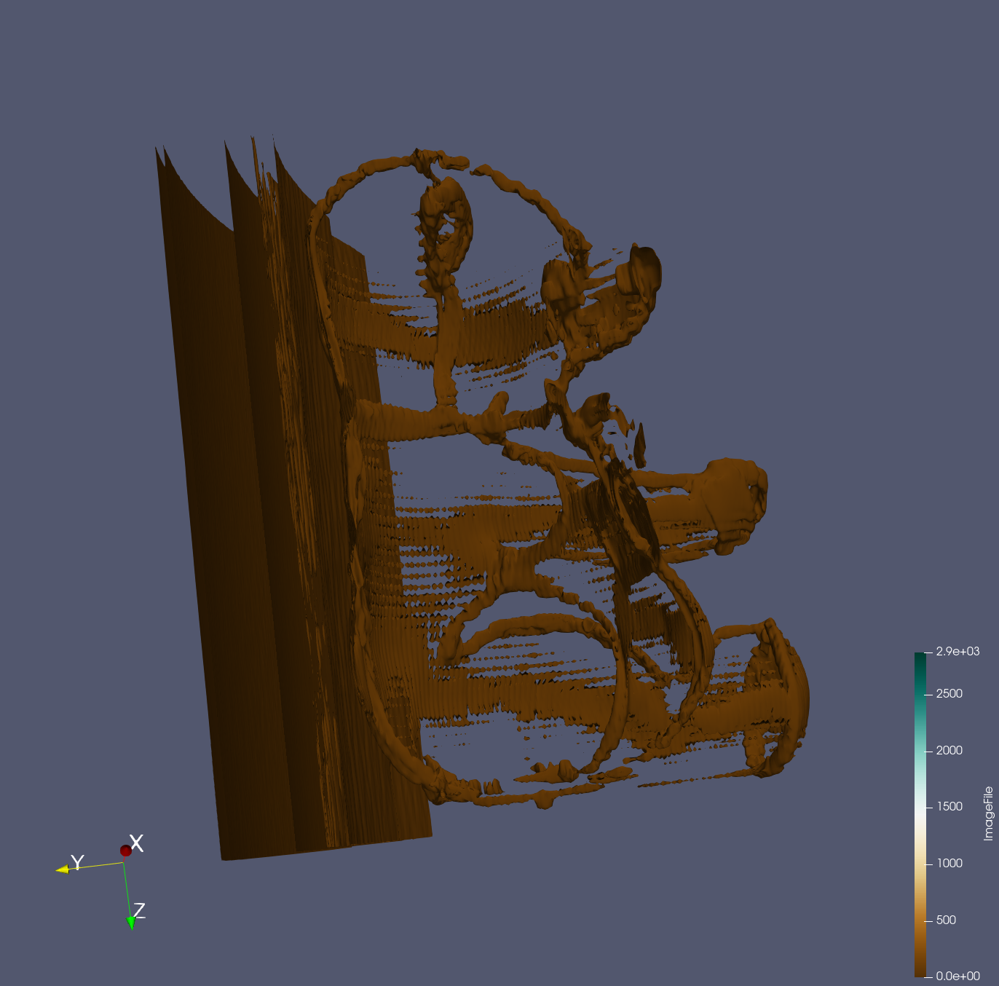

Put your 2nd data1 design concept here

{(aim|}
1- To show what the item at the back of the teddy bear represents, the user will be able to that the item looks like a flat wood. 
2- To show if there are any items inside the teddy bear. After visualization,  the user will see that there are no items inside the bear. 
{|aim)}

Threshold 

Flat wood

Empty bear

{(vismapping|}
**Properties**: 1- (Data extent -> (0 - 511),(0 - 511),( 0 - 62 )) and (2- Data spacing -> (1 - 1 - 7))
**Contour**: Isosurface -> 150 
**Backface Representation**: follow frontface 
**Representation**: Surface
**Threshold**: (min - 150, max - 150)
**Clip type**: plane (Y- Normal, Origin(254.728, 330.989, 261.037), Normal(0.0915914, -0.994543, -0.0499584) )
{|vismapping)}

{(dataprep|}
1- Threshold
2- Contour
3- Clip
{|dataprep)}

{(limitations|}
limitation- The item behind the bear could be any item however i am concluding it as a wood because it kind of looks like one. 
Improvement- Discover more filters that can help visualize the item better. 
{|limitations)}
