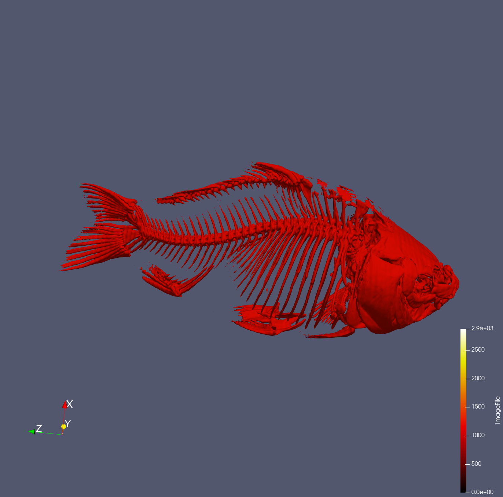
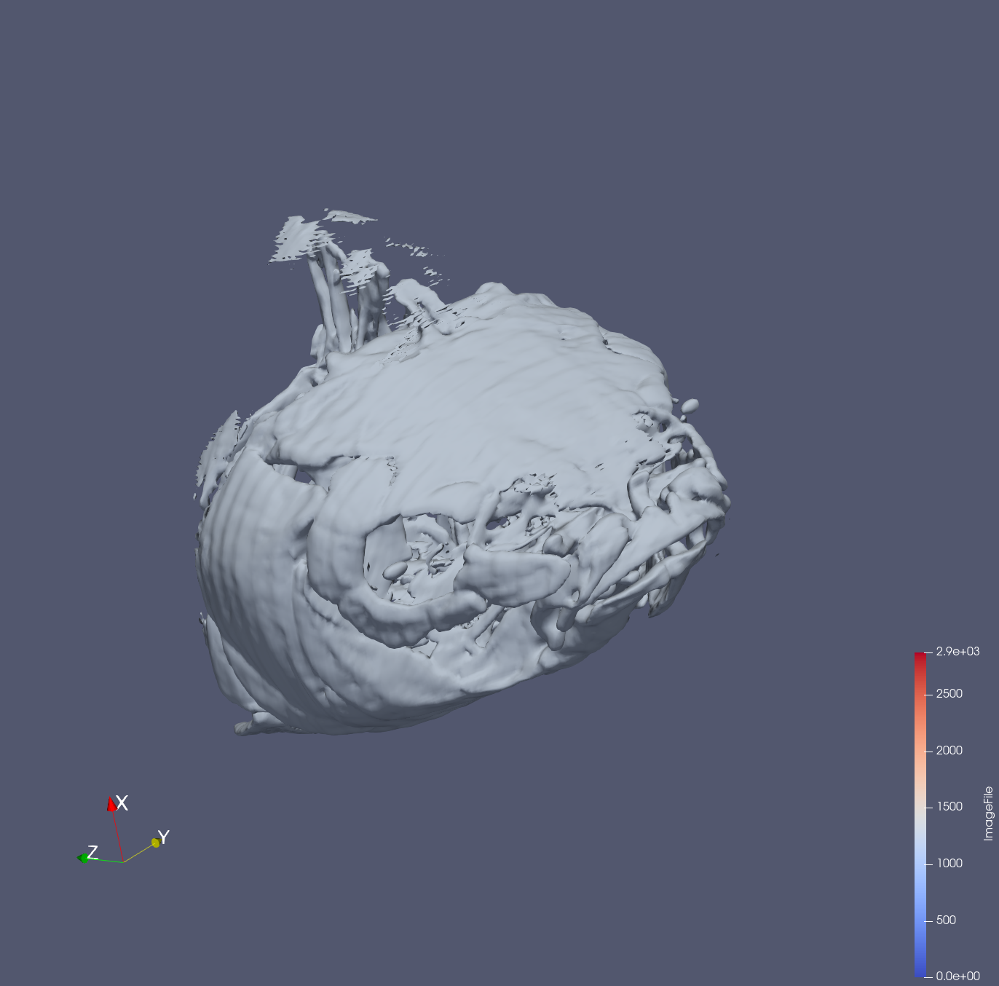
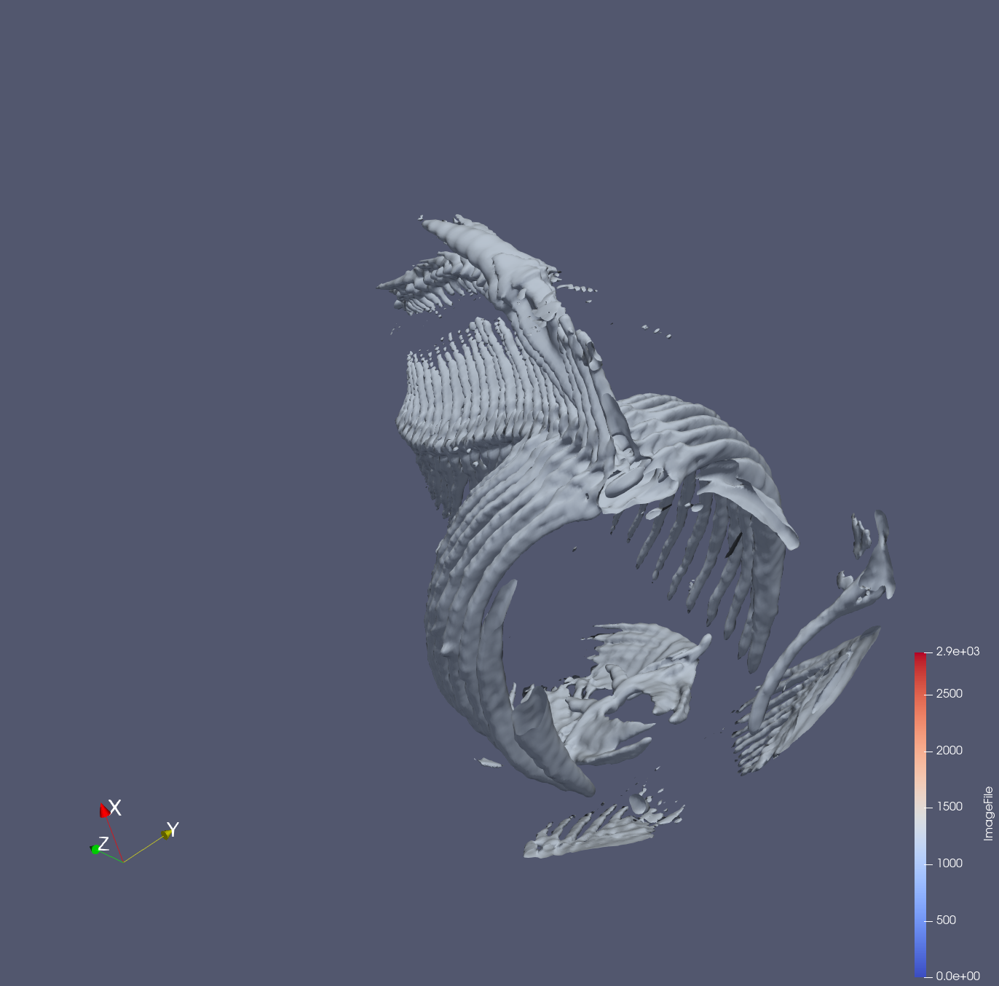
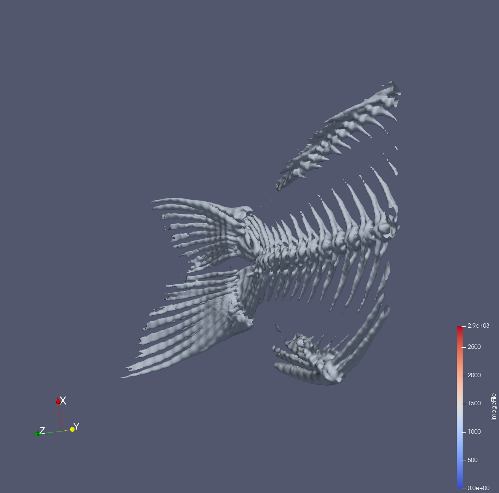
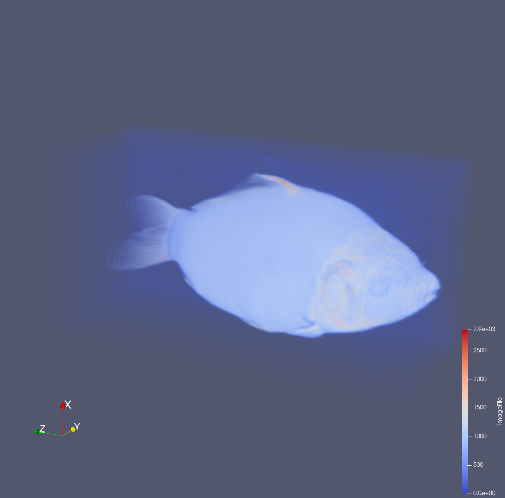
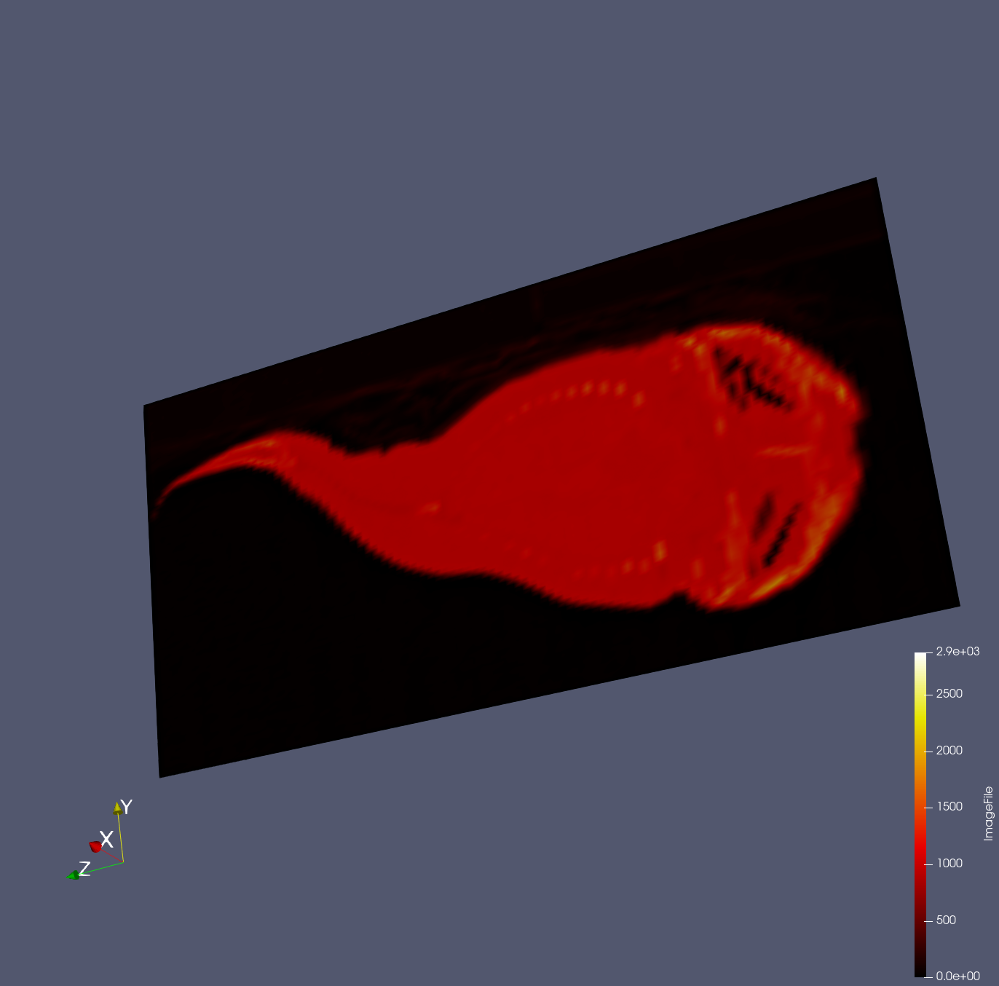

Put your 1st data2 design concept here

{(aim|}
To visualize the loaded data and discover what items is presented within the data. After visualizing, the user will be able to view a fish figure, the following visualization of the fish include: 
1- The skeleton of the fish and the different sections such as the head, body and the tail. 
2- The full visualization of the fish and the x-ray view of the fish at the middle. 
{|aim)}

Skeleton full view 

Skeleton head view 

Skeleton body view 

Skeleton tail view 

The full fish

The X-ray of the middle 

{(vismapping|}
**Properties**:(Data Extent(255,255,511))
**Contour**: (Isosurface(1200))
**Clip-head**: (Type-plane, Origin(127.236,119.91,159.934))
**Clip-body**: (Type-box, Position(-76.352,235.706,94.6423), Rotation(75.8435,-2.10466,37.8009), Length(197.88,198.259,489.175))
**Clip-tail**: (Type-box, Position(208.99,279.978,468.569), Rotation(6.23125,-172.357,106.357), Length(197.88,198.259,200))
**ResamplingtoImage**: (sampling dimension(100,100,100, Representation-Volume))
**Slice-middle-x-ray**: (Type-plane, X-Normal, Origin(83.5527, 127.5,255.5), Normal(1,0,0))
{|vismapping)}

{(dataprep|}
1- Contour
2- Clip
3- ResamplingtoImage
4- Slice
{|dataprep)}

{(limitations|}
Limitation- Not able to show the actual color of the fish and its scales. 
Improvement- Learn and Research on more techniques and filter to achieve that 
{|limitations)}