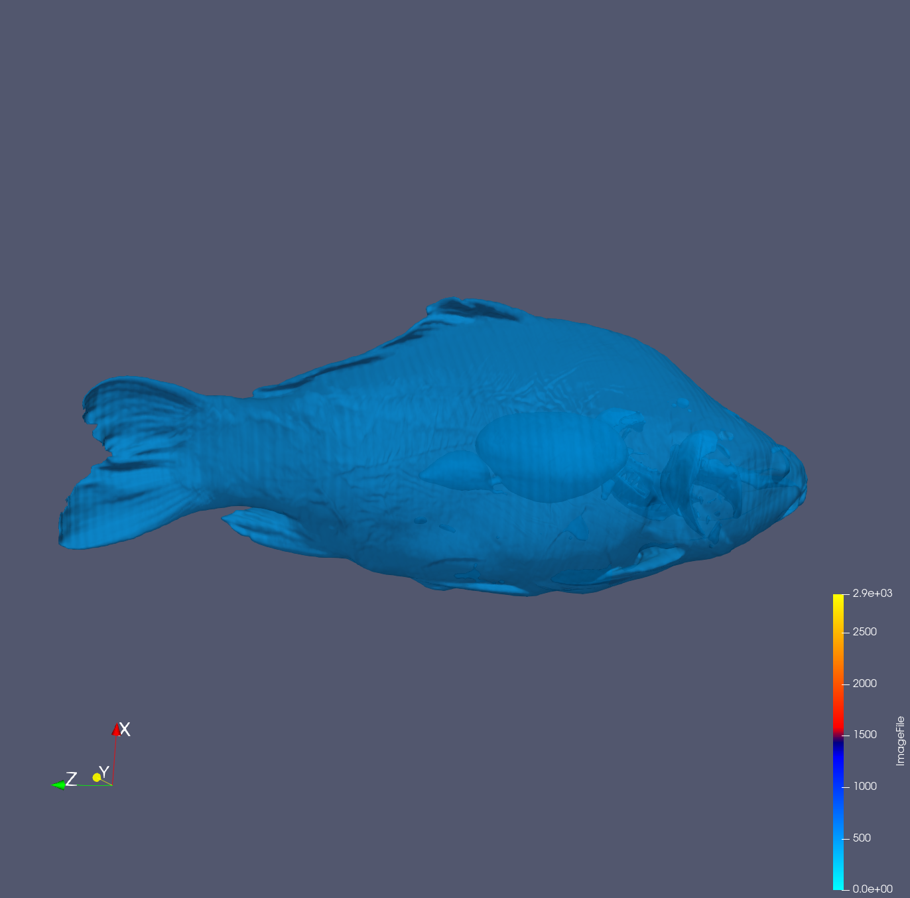
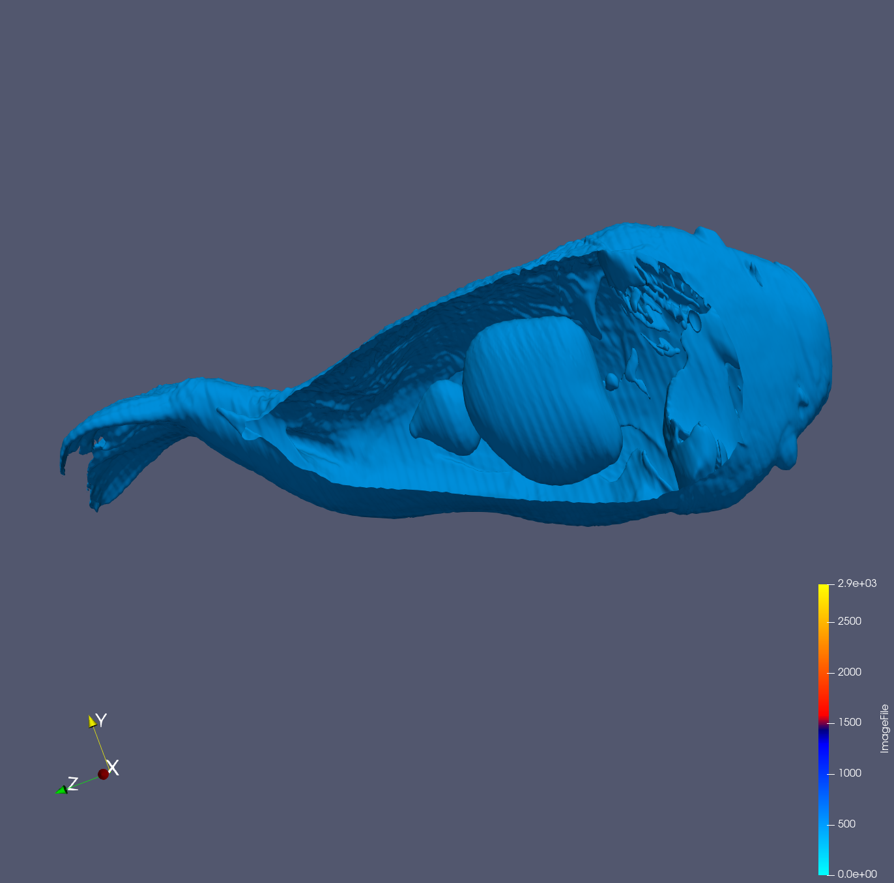
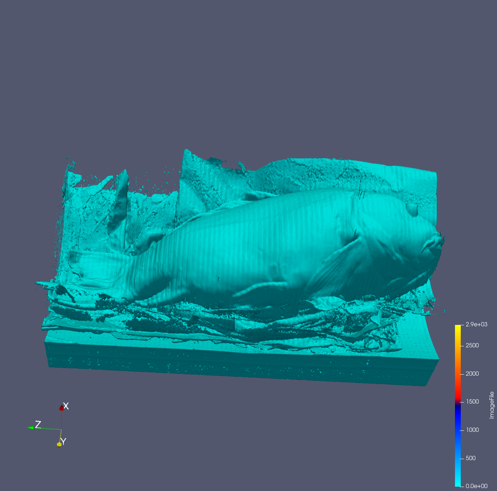
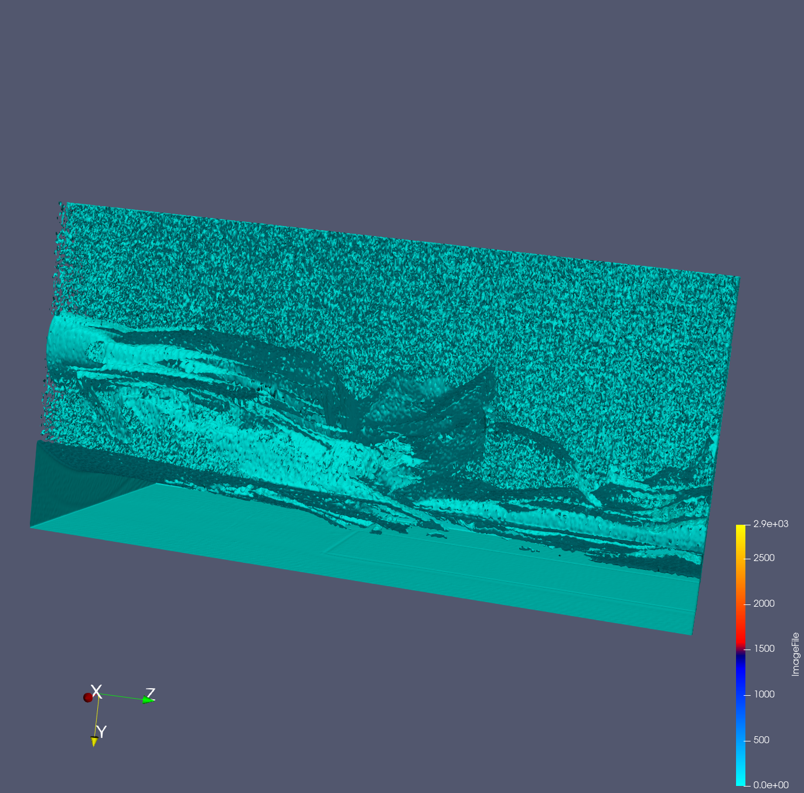

Put your 2nd data2 design concept here

{(aim|}
After visualizing, the user will see the full fish with its skin. This is because of th opacity that was applied. The user will be to see the organs of the fish and the object that is below the fish. This visualization includes: 
1- The full fish showing the organs.
1- A top view of the organs in the fish
3- The object below the fish is discovered after contouring the data. The object looks like a surface at the same sometimes it looks like water particles. The lower the Isosurface in contour the object changes. 
{|aim)}

The full fish showing the organs

The organs of the fish from a top and clearer view 

The object that looks like a surface 

The object that looks like a water particles

{(vismapping|}
**Contour**:(Isosurface(500), Opacity(0.61))
**Clip**: (Type-plane, X-Normal, Origin(160.715,121.094,257.901), Normal(1,0,0))
**Contour-surface**: (Isosurface- 60)
**Contour-water**: (Isosurface- 25)
{|vismapping)}

{(dataprep|}
1- Contour
2- Clip
{|dataprep)}

{(limitations|}
Limitation1- Only can view two organs, so the user do not know if there are any more organs
Limitation2- The item below or around the fish is not very clear and cannot be identified easily.
Improvement- Research and discover more techniques that can be used to help identify the item below the fish and if there are any more organs in the fish.
{|limitations)}